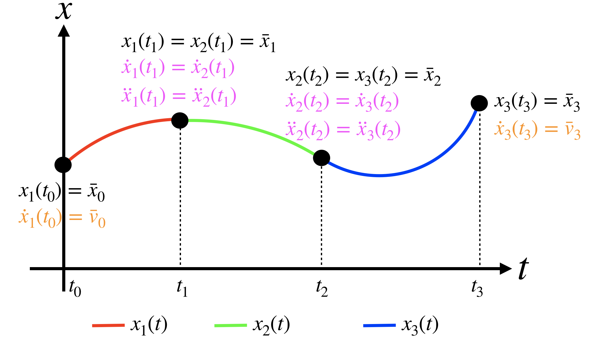

# TUM LRG 6300 Autonomous Systems

## Assignment - Trajectory Generation

#### Table of contents
1. [Introduction and Overview](#intro)
2. [Deliverables](#deliverables)
   1. [Task 1](#task1)
   2. [Task 2](#task2)
   
There are two tasks to complete. Please make sure to read the full documentation beforehand.

### 1. Introduction and Overview <a name="intro"></a>
In this section, we are going to implement a trajectory planner as presented in the class on a simulated drone.

We now require several more packages in order to do the trajectory optimization. 
In the following, we will walk you through adding those to your `src` folder. 

First, we need to clone an external package from the ETH Zurich, that defines the used ROS messages 
for communicating with the quadrotor. Go to the `/src` folder and add it using (this is the same as last time)
```bash
git submodule add https://github.com/ethz-asl/mav_comm.git
```

We also need the trajectory generation package:
```bash
git submodule add https://github.com/ethz-asl/mav_trajectory_generation.git
```

Further support-modules that are required are:
```bash
git submodule add https://github.com/ethz-asl/eigen_catkin.git
git submodule add https://github.com/ethz-asl/eigen_checks.git
git submodule add https://github.com/catkin/catkin_simple.git
git submodule add https://github.com/ethz-asl/glog_catkin.git
git submodule add https://github.com/ethz-asl/nlopt.git
```

Pitfall: Depending on if you run Ubuntu 20 or 18, you *might* need to add the yaml_cpp package, too! 
Find it at `https://github.com/ethz-asl/yaml_cpp_catkin.git`

Do not forget your git submodule operations from here on! (init, update)

Now, you are ready to run 
```bash
catkin build
```

During your first built, the building might fail. 
Please allow execution of the following script and restart the build:
```bash
chmod +x build/nlopt/make_install_nlopt.sh
```

Once the built is finished launch the following three rosnodes and ros launch files in three terminals 
(don't forget to source the `setup.bash` in all terminals):

```bash
roslaunch unity_bridge unity_sim.launch
rosrun controller_pkg controller_node
roslaunch mav_trajectory_generation_example example.launch
```


### 2. Deliverables <a name="deliverables"></a>

#### 2.1 Task 1 <a name="task1"></a>

- Assume our goal is to compute the minimum snap trajectory (`r=4`) over `k` segments. 
How many and which type of constraints (at the intermediate points and at the start and end of the trajectory) do we 
need in order to solve this problem? Specify the number of waypoint constraints, 
free derivative constraints and fixed derivative constraints (see Figure below).
- Can you extend the previous question to the case in which the cost functional minimizes the `r`-th derivative and we 
have `k` segments?

Provide your solution in your README file. 



#### 2.2 Task 2  <a name="task2"></a>
In this coding assignment your task is to compute a trajectory to make the quadrotor fly through the given parkour. 
The implementation of the planning architecture is largely based on the work of 
C. Richter et al (C. Richter, A. Bry, and N. Roy, “Polynomial trajectory planning for aggressive quadrotor flight 
in dense indoor environments,” in International Journal of Robotics Research, Springer, 2016). 
The codebase itself has been mainly developed at ETH Zürich and can be found 
[here](https://github.com/ethz-asl/mav_trajectory_generation).

The obstacles itself are placed at the following locations:


- p_1 = [10, 0, 3]
- p_2 = [30, 10, 3]
- p_3 = [35, 25, 13]
- p_4 = [35, 35, 6]
- p_5 = [25, 39, 11]
- p_5 = [16, 39, 11] (Tunnel entrance!)

Your task is to generate a trajectory that allows the robot to fly two loops through the parkour and land at the starting location. 
During the second loop the quadrotor shall come to a full stop (zero velocity and acceleration in the middle of the tunnel).
You might need to add additional waypoints around the tunnel. 
Note that the goal position is defined in `planner_node.cc`, lines 29-31

In order to set waypoints for the trajectory planner you have to adopt the file

```cpp
basic_waypoint_pkg/src/planner.cc
```

Also take a look at the ETH example available [here](https://github.com/ethz-asl/mav_trajectory_generation/tree/master/mav_trajectory_generation_example/src)

Currently only the initial the starting and the goal location are added to the planner:

```cpp
/******* Configure start point *******/
// set start point constraints to current position and set all derivatives to zero
start.makeStartOrEnd(current_pose_.translation(),
derivative_to_optimize);

// set start point's velocity to be constrained to current velocity
start.addConstraint(mav_trajectory_generation::derivative_order::VELOCITY,
current_velocity_);

// add waypoint to list
vertices.push_back(start);


/******* Configure end point *******/
// set end point constraints to desired position and set all derivatives to zero
end.makeStartOrEnd(goal_pos,
derivative_to_optimize);

// set start point velocity to be constrained to current velocity
end.addConstraint(mav_trajectory_generation::derivative_order::VELOCITY,
goal_vel);

// add waypoint to list
vertices.push_back(end);
```
Your task is to push additional waypoints and waypoint constraints (for the stopping in the tunnel) to enable the quadrotor to master the parkour.

Please start by pushing additional waypoints using the trajectory gerneration vertex `middle`, initialized in line 59:

```cpp
mav_trajectory_generation::Vertex start(dimension), end(dimension), middle(dimension) ;
```

The constraints should be loaded from the according YAML file in `config/trajectory_config.yaml`. 
How fast can you make the quad go?
Pitfall: do not forget to free constraints of your middle waypoint before reusing it.
##### Important notes on the autograding
The autograding will only pass if the quadrotor doesn't crash in the unmoved pillar in the unity simulation! Also, it can be possible that the test of the maximum and minimum wrench of the autograding fails. In this case, the simulation computes forces/moments which could not be generated using the real quad. Try to adjust your waypoints.

Good luck!

